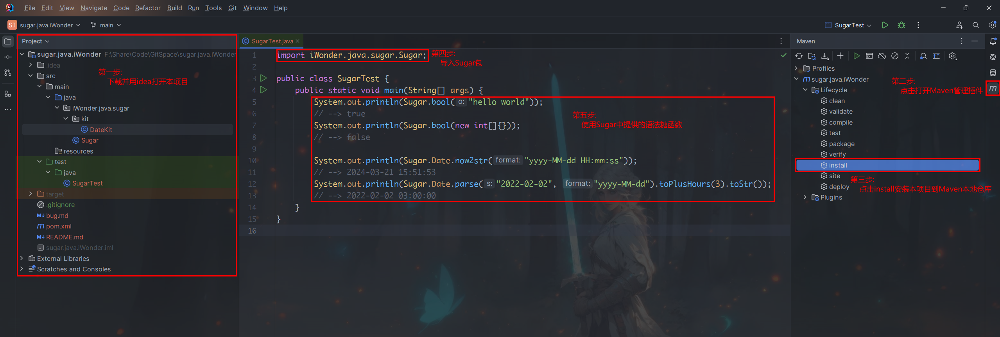

# iWonder Java Sugar

> 一些我喜欢的Java语法糖函数。
>
> 灵感来自于Python。

## 注意事项 / Attention

> 长期维护，发现bug欢迎`issue`~
>
> 如果觉得好用，也请动动小手🌟`star`一下哦~

## 使用方式 / USAGE

> 1. 第一步: 下载并用idea打开本项目
> 2. 第二步: 点击并打开Maven管理插件
> 3. 第三步: 点击install安装本项目到Maven本地仓库
> 4. 第四步: 在你自己的项目中, 通过`import iWonder.java.sugar.Sugar;`导入Sugar包
> 5. 第五步: 使用Sugar中提供的语法糖函数
>
> 

## 函数 / Method

### 1. 命名格式化字符串

```
    /**
     * NOTE: 格式化命名字符串.
     *  第一个参数为格式化模板. 以{diyName}的方式指定并命名一个要替换的模块.
     *  剩下的参数两两一对. 分别表示模板中的名字 和 要实际替换的值
     * 示例:
     *  Sugar.format("name: {name}, age: {age}",
     *  "name", "Anne",
     *  "age", 15)
     *  -----> "name: Anne, age: 15"
     */
```

### 2. 多值打印

```
    /**
     * NOTE 同时打印多个任意数据类型的值.
     *  并添加了数组打印支持, 即默认将数组中内容打印出来.
     * 示例:
     *  String[] arr2 = {"dashi", "baiqun", "wangxiang", "wennuan", "ni"};
     *  ArrayList list = new ArrayList<>();
     *  list.add(1);
     *  list.add(2);
     *  Sugar.print(11, "asfs", arr2, list);
     *  -->  11    asfs    [dashi, baiqun, wangxiang, wennuan, ni]    [1, 2]
     */
```

### 3. Sleep

```
    /**
     * NOTE 以秒为单位, 睡一会儿~
     * 示例:
     *  Sugar.sleep(5);
     */
```

### 4. 获取任意对象的布尔值

```
/**
     * NOTE 返回给定对象的布尔值
     *  null, false, 数字类型的0值, 长度为0的数组|列表|集合|map|字符串 等等 认定其bool值为false.
     *  反之则为true.
     * 示例:
     *  Sugar.bool("hello")  -> true.
     *  Sugar.bool(0)        -> false.
     */
```

### 5. 或运算

```
    /**
     * NOTE 依次判断传入参数的bool值,
     *  若为false, 则继续判断下一个参数的bool值.
     *  直到找到bool值为true的参数, 返回该参数
     *  或者 当前已经是最后一个参数, 返回该参数
     * 示例:
     *  or("1", "a", "a", "", "c", "sdfs")  返回"1"
     *  or("", "", "", "", "", "")          返回""
     */
```

### 6. 与运算

```
    /**
     * NOTE 依次判断传入参数的bool值,
     *  若为true, 则继续判断下一个参数的bool值.
     *  直到找到bool值为false的参数, 返回该参数
     *  或者 当前已经是最后一个参数, 返回该参数
     * 示例:
     *  and("1", "a", "a", "", "c", "sdfs")   返回""
     *  and("1", "a", "a", "d", "c", "sdfs")  返回"sdfs"
     */
```

### 7. 日期时间处理工具集

```
    /**
     * NOTE 时间处理函数 相关
     *  基本原则: 不用过时的Date库 使用DateTime库
     *  命名时: dt代表datetime  ts代表timestamp(Long类型 毫秒为单位)  str代表时间序列化后的字符串  format代表时间序列化的模板 2代表to
     *  str dt ts 等关键字全部用小写
     *  所有 setXXX parse函数会修改全局属性
     *  其他 函数不会修改全局属性, 只作为临时使用
     *  dt ts 都是utc概念. 只有在与str相互转换时,才会涉及时区(zone)和格式化字符串(format)
     * NOTE
     *  链式用法, 函数名统一前缀to关键字
     *  函数式用法, 函数名
     * 示例:
     *  1. 获取当前时间戳
     *       Sugar.Date.now2ts();  -> 1710931966273
     *  2. 获取当前时间字符串
     *       Sugar.Date.now2str("yyyy-MM", "UTC+7");  -> 2024-03
     *  3. 时间字符串计算(获取去年的字符串)
     *       Sugar.Date.strPlusYears("2024-03-20","yyyy-MM-dd", -1L)  -> 2023-03-20
     *  4. 时间字符串重新格式化
     *       Sugar.Date.str2str("2024-03-20 14:52:51", "yyyy-MM-dd HH:mm:ss", "yyyy-MM-dd HH:mm:ss", "UTC+8", "UTC+7")
     *            -> 2024-01-20 14:52:51
     *  5. 链式用法
     *       Sugar.Date.parse("2024-03-20 14:52:51").toTs()  -> 1710917571000
     *       Sugar.Date.setZone("UTC+8").setFormat("yyyy-MM-dd-").parse("2024-03-20-").toPlusDays(12L).toStr()
     *            -> 2024-04-01-
     */
```

### 8. 更多细节详见代码注释~
